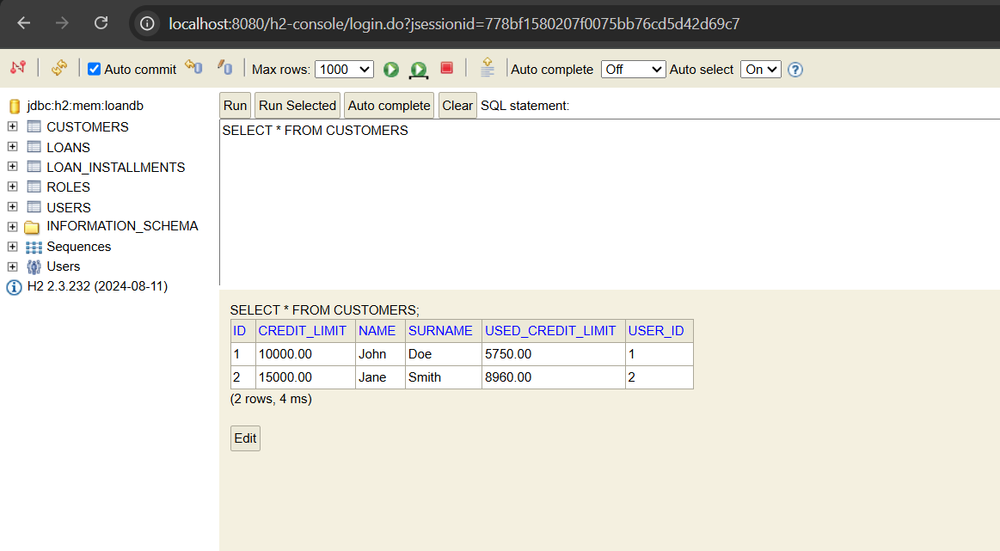
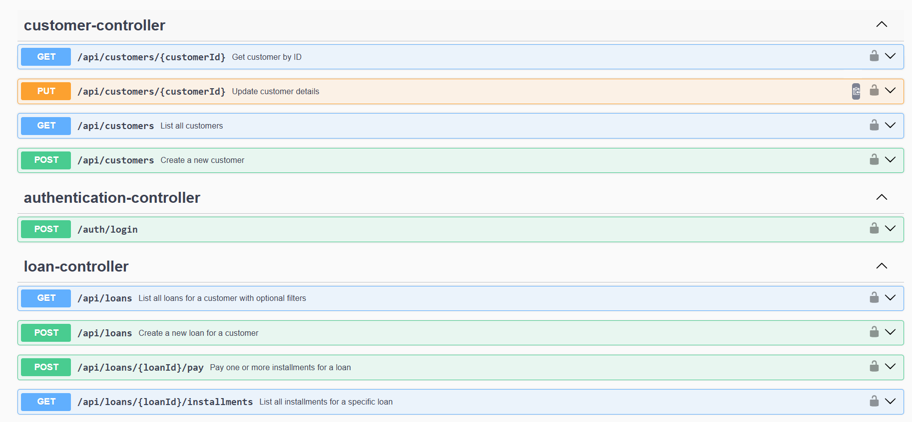
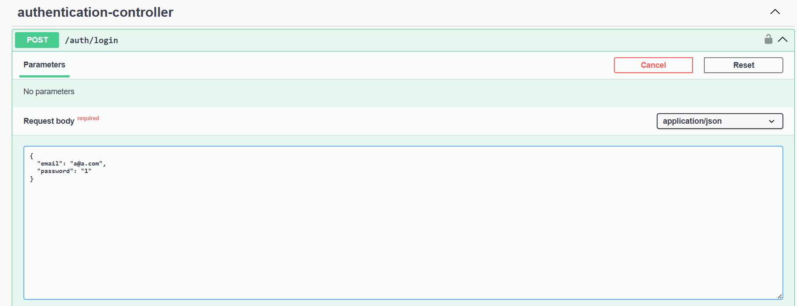
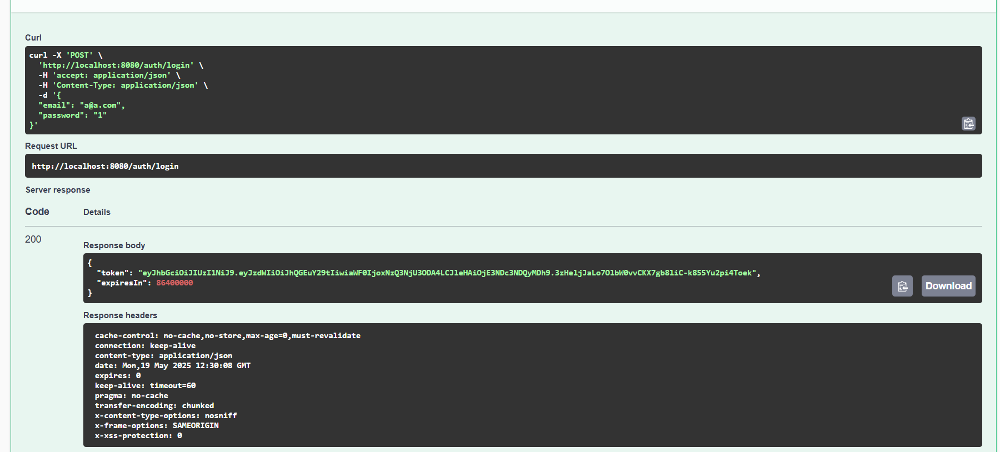
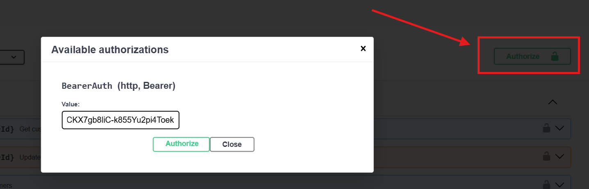
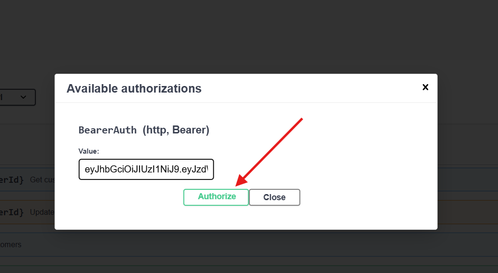
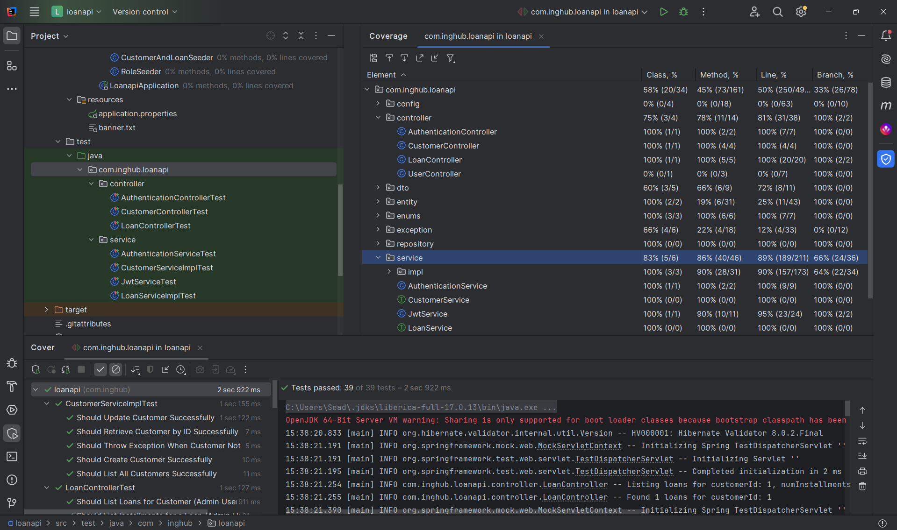

# Loan Management API 🚀

[](https://www.oracle.com/java/)  [](https://spring.io/projects/spring-boot)  [](https://maven.apache.org/) 
[](https://www.h2database.com/)  [](https://swagger.io/)  [](https://junit.org/junit5/)

## 📌 Project Overview
This **Loan Management API** is a robust and scalable backend solution for managing loans, customers, and loan installments. Built using **Java 17** and **Spring Boot 3.4.5**, this API is designed to be secure, performant, and maintainable.

### 🚀 Key Features
- Create, list, and manage loans for customers.
- Process loan installment payments with advanced rules:
  - Only full installments are paid.
  - Payments are applied to the earliest unpaid installments.
  - Payments cannot be made for installments due more than 3 months ahead.
  - Early payments receive discounts, and late payments incur penalties.
- Clean, secure, and efficient API design.
- Comprehensive API documentation with **Swagger UI**.

---  

## ⚡️ Tech Stack
- **Java 17**: The core programming language.
- **Spring Boot 3.4.5**: Framework for building a scalable and secure API.
- **Spring Security**: Secures endpoints with JWT authentication.
- **Spring Data JPA**: Data persistence with clean and efficient repositories.
- **H2 Database**: Lightweight in-memory database for fast and easy testing.
- **MapStruct**: Efficient DTO mapping for clean code.
- **Lombok**: Reduces boilerplate code for entities and DTOs.
- **Maven**: Dependency management and build automation.
- **Swagger (Springdoc OpenAPI)**: API documentation.
- **JUnit 5**: Unit and integration testing.

---  

## 🚦 System Requirements
- **Java 17** or later
- **Maven 4.0.0** or later
- **Internet Connection** (for dependency download)
- **Any IDE (IntelliJ IDEA, Eclipse, VS Code)**

---  

## 🚀 Getting Started

### ✅ Clone the Repository

``` git clone https://github.com/your-username/loan-management-api.git  
cd loan-management-api  
```  

✅ Build the Project
```  
mvn clean install  
```  

✅ Run the Application

```  
mvn spring-boot:run  
```  

✅ Access the API Documentation

Open your browser and visit:
```  
http://localhost:8080/swagger-ui/index.html  
```  

✅ Access H2 Console

The H2 Console can be accessed via the URL: http://localhost:8080/h2-console.



## 🚀 API Documentation for Loan Management System

### ✅ API Endpoints 🚀



#### 📌 **Customer API**
- **`GET /api/customers/{customerId}`** - Retrieve customer details.
- **`PUT /api/customers/{customerId}`** - Update customer details.
- **`GET /api/customers`** - List all customers.
- **`POST /api/customers`** - Create a new customer.

---

### 📌 **Authentication**
- **`POST /auth/login`** - User login to obtain JWT token.

---

### 📌 **Loan API**
- **`GET /api/loans`** - List all loans for a customer with optional filters.
- **`POST /api/loans`** - Create a new loan for a customer.
- **`POST /api/loans/{loanId}/pay`** - Pay one or more installments for a loan.
- **`GET /api/loans/{loanId}/installments`** - List all installments for a specific loan.

---

###  Data Initialization with Seeders
The seeders (AdminSeeder, CustomerAndLoanSeeder, RoleSeeder) are added to bootstrap essential data 
automatically when the application starts. These seeders ensure that the necessary roles, 
users, and initial customers with loans are created in the database without manual intervention. 
This setup simplifies the testing process and guarantees that the system is always initialized 
with consistent base data.


### ✅ Payment Rules Explained 💡

- 🔹 **Only Full Installments Can Be Paid:**
  - Partial payments are not allowed for an installment.

- 🔹 **Payments Are Applied to the Earliest Unpaid Installments:**
  - Payments are applied in chronological order of unpaid installments.

- 🔹 **Three-Month Payment Limit:**
  - Payments cannot be made for installments due more than **3 months ahead**.

- 🔹 **Discounts for Early Payments:**
  - If an installment is paid **before the due date**, a discount is applied.
  - Discount Formula:
    ```plaintext
    Discount = installmentAmount * 0.001 * (number of days before due date)
    ```

- 🔹 **Penalties for Late Payments:**
  - If an installment is paid **after the due date**, a penalty is applied.
  - Penalty Formula:
    ```plaintext
    Penalty = installmentAmount * 0.001 * (number of days after due date)
    ```

---

### ✅ Security 🔒
- **JWT Authentication:** All endpoints are secured using JWT (JSON Web Token).
- **Role-Based Access Control:**
  - 🔑 **ADMIN:** Can manage all customers and loans.
  - 🔑 **CUSTOMER:** Can only view and pay their own loans.

---

### ✅ Example Usage

### 🌐 **Login (Authentication)**

> Admin
```json
POST /auth/login
{
    "email": "a@a.com",
    "password": "1"
}
```

> User
```json
POST /auth/login
{
    "email": "u@a.com",
    "password": "1"
}
```


## ⚡ How to Login:
1- Open Swagger UI or Postman.

2- Use the POST /auth/login endpoint.

3- Provide the credentials:

4- Email: a@a.com (Admin User)

5- Password: 1




6- Copy the JWT token from the response.



7- Authorize with JWT in Swagger:



8- Click on the Authorize button in Swagger UI.

Enter the token as:




### ✅ User Management (Admin Only)
📌 Create a New User:
URL: POST /api/users

Request Body (Example):

```json
{
"fullName": "John Smith",
"email": "john.smith@example.com",
"password": "password123",
"role": "CUSTOMER"
}
```

#### ⚡ How to Create:
Ensure you are logged in as an Admin using JWT.

Use the POST /api/users endpoint.

Provide the user details.

Verify the user is created successfully in the response.

#### 🔧 Assign Roles to Users:
URL: PUT /api/users/{userId}/roles

Permissions: Admin only.

Roles Available: ADMIN, CUSTOMER.

#### ✅ Customer Management

📌 Create a Customer:
URL: POST /api/customers

Request Body:

```json
{
"name": "Alice",
"surname": "Johnson",
"creditLimit": 10000.00,
"role": "CUSTOMER"
}
```

#### ⚡ How to Create:
Ensure you are logged in as an Admin using JWT.

Use the POST /api/customers endpoint.

Provide the customer details.

Confirm the customer is created successfully.

#### 📌 View Customer Details:
URL: GET /api/customers/{customerId}

Permissions:

Admin can view all customers.

Customer can view their own details.

####  📌 List All Customers:
URL: GET /api/customers

Permissions: Admin only.

####  📌 Update Customer:
URL: PUT /api/customers/{customerId}

Request Body:

```json

{
"name": "Alice Updated",
"surname": "Johnson",
"creditLimit": 12000.00
}
```

####  ✅ Loan Management
📌 Create a New Loan:
URL: POST /api/loans

Request Body:

``` json
{
"customerId": 1,
"amount": 5000.00,
"interestRate": 0.1,
"numberOfInstallments": 12
}
```

####  ⚡ How to Create:
Ensure you are logged in as an Admin using JWT.

Use the POST /api/loans endpoint.

Provide the loan details.

Confirm the loan is created with the specified number of installments.

####  ⚠️ Loan Creation Rules:
Number of installments can only be 6, 9, 12, or 24.

Interest rate must be between 0.1 and 0.5.

Total loan amount is calculated as:

> totalAmount = amount * (1 + interestRate)
The customer's credit limit is checked before creating the loan.

#### ✅ Loan Installments

📌 View Loan Installments:
URL: GET /api/loans/{loanId}/installments

Permissions:

Admin can view all installments.

Customer can view their own installments.

####  ⚡ How to List:
Use the GET /api/loans/{loanId}/installments endpoint.

Provide the loanId.

Confirm that the list of installments is displayed.

#### ✅ Loan Payment
📌 Pay Loan Installment(s):
URL: POST /api/loans/{loanId}/pay

Request Body:

``` json
{
"loanId": 1,
"paymentAmount": 500.00
}
```

#### ⚡ How to Pay:
Ensure you are logged in using JWT (Admin or Customer).

Use the POST /api/loans/{loanId}/pay endpoint.

Provide the loan ID and the payment amount.

Confirm the payment is processed correctly.

#### ⚡ Payment Rules:
Payments are applied to the earliest unpaid installments.

Only full installments can be paid.

Payments cannot be made for installments due more than 3 months ahead.

Early payments receive a discount:


> Discount = Installment Amount * 0.001 * Days Early
Late payments incur a penalty:


> Penalty = Installment Amount * 0.001 * Days Late

📌 Payment Scenarios:
✅ Pay an installment 5 days before the due date (discount applied).

✅ Pay an installment 10 days after the due date (penalty applied).

✅ Pay an installment on the due date (no discount, no penalty).

✅ Pay an installment 15 days early (larger discount).

✅ Pay an installment 15 days late (larger penalty).

✅ Security and Permissions
🔒 JWT Authentication:
All endpoints (except /auth/login) are protected with JWT authentication.

🔑 Role-Based Access Control:
Admin:

Can manage all users, customers, and loans.

Can assign roles to users.

Customer:

Can view and pay their own loans.

Cannot create or update other customers.

✅ Security  
Endpoints are protected with JWT authentication.

Role-based access control:

ADMIN can manage all customers and loans.

CUSTOMER can only view and pay their own loans.


✅ Testing  
Comprehensive unit and integration tests with JUnit 5.

Test coverage: 
  

> Service layer ->  89% 

> Controller layer ->  81 % 

> Repository layer -> 100%

✅ Run Tests

```  
mvn test  
```  


#### 📌 CustomerServiceImplTest
✅ Should Update Customer Successfully - Verifies that a customer's details are correctly updated.

✅ Should Retrieve Customer by ID Successfully - Confirms that a customer can be fetched by their ID.

✅ Should Throw Exception When Customer Not Found - Ensures that an exception is thrown if the customer ID is invalid.

✅ Should Create Customer Successfully - Tests that a new customer can be created correctly.

✅ Should List All Customers Successfully - Verifies that all customers can be retrieved in a list.

#### 📌 CustomerControllerTest
✅ Should Update Customer Successfully - Ensures the controller correctly updates customer details.

✅ Should List All Customers Successfully - Confirms that all customers can be listed.

✅ Should Retrieve Customer by ID Successfully - Verifies that the controller fetches a customer by ID.

✅ Should Create Customer Successfully - Tests the successful creation of a new customer through the controller.

#### 📌 LoanServiceImplTest
✅ Should Not Apply Discount or Penalty for On-Time Payment - Verifies that the paid amount remains the same if the payment is made exactly on the due date.

✅ Should Calculate Correct Installment Amount for 6, 9, 12, and 24 Installments - Ensures the accurate calculation of installment amounts for all allowed durations.

✅ Should Create Loan Successfully - Tests the successful creation of a loan with valid parameters.

✅ Should List Loans Successfully - Confirms that loans for a specific customer are fetched correctly.

✅ Should Calculate Total Loan Amount Correctly - Verifies the correct calculation of the total loan amount using the formula: (principal * (1 + interest)).

✅ Should Throw Exception When Customer Not Found - Tests that an exception is thrown if the customer does not exist.

✅ Should Throw Exception for Insufficient Credit Limit - Ensures that a loan cannot be created if the customer exceeds their credit limit.

✅ Should Throw Exception When Loan Already Paid - Confirms that a fully paid loan cannot be paid again.

✅ Should Throw Exception for Invalid Loan Parameter - Verifies that invalid loan parameters are not accepted.

✅ Should List Installments for Loan Successfully - Tests that all installments for a specific loan are listed.

✅ Should Apply Discount for Early Payment - Verifies that a discount is applied for payments made before the due date.

✅ Should Throw Exception When Loan Not Found for Installments - Ensures that an exception is thrown if the loan does not exist.

#### 📌 LoanControllerTest
✅ Should List Loans for Customer (Admin User) - Verifies that an admin can list all loans.

✅ Should List Installments for a Loan (Admin User) - Tests that an admin can list all installments for a loan.

✅ Should Pay Loan Installments Successfully - Confirms that loan installments can be paid.

✅ Should Create Loan Successfully (Admin User) - Ensures that an admin can create a new loan.

✅ Should Return Bad Request for Mismatched Loan ID in Payment - Verifies that a bad request is returned for invalid loan ID.

#### 📌 JwtServiceTest
✅ Should Generate Token with Custom Claims Successfully - Verifies that JWT tokens are correctly generated with additional claims.

✅ Should Validate Token Successfully - Confirms that the JWT token is validated correctly.

✅ Should Extract Username Successfully - Ensures that the username can be extracted from the JWT token.

✅ Should Extract All Claims Successfully - Verifies that all JWT claims can be extracted.

✅ Should Handle Malformed Token Gracefully - Ensures that malformed tokens do not cause a crash.

✅ Should Return False for Token with Different Username - Confirms that the JWT token is invalid if the username does not match.

#### 📌 AuthenticationControllerTest
✅ Should Authenticate User and Return JWT Token Successfully - Verifies successful user authentication and JWT token generation.

✅ Should Return Unauthorized (401) When Invalid Credentials - Ensures a 401 response is returned for invalid credentials.

✅ Should Return Bad Request for Invalid Request Body - Verifies that invalid login requests are rejected.

#### 📌 AuthenticationServiceTest
✅ Should Authenticate User Successfully - Confirms that a user can be authenticated with valid credentials.

✅ Should Throw Exception When User Not Found - Verifies that an exception is thrown if the user does not exist.

✅ Should Throw Exception for Invalid Credentials - Ensures that an exception is thrown for incorrect credentials.
